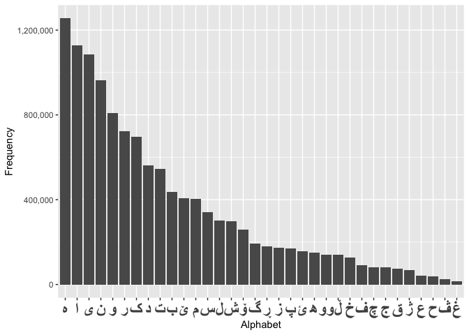

Various Kurdi related work done by Kurdish developers.
================

# kurdi

There are some hopefully useful files/scripts/chunks etc. to share with
Kurdi developers.

1.  kurdi\_words.txt: a list of Kurdish words (currently 1,668,692),
    unique and alphabetically ordered (thanks to @dolanskurd). Note that
    in the bar chart below, each of (و) and (ی) counted as both vowel
    and consonant.

2.  unicode\_list.txt: list of unicode values for Kurdish alphabet
    (Arabic script) standard accepted and published on
    <http://unicode.ekrg.org/ku_unicodes.html>

3.  [gettext](https://en.wikipedia.org/wiki/Gettext) translations,
    includes ku.po for Drupal. Most of the translations come from
    <https://localize.drupal.org/translate/languages/ku> (now almost
    dead

4.  KRG health institutions data (lat/lng and names) throughout KRG (see
    health)

Now that we have some good unique nad cleaned up wordlist. We can do
some statistics on them (in R for now):

``` r
w = readLines("https://raw.githubusercontent.com/layik/kurdi/master/corpus/kurdi_words.txt")
```

    ## Warning in readLines("https://raw.githubusercontent.com/layik/kurdi/
    ## master/corpus/kurdi_words.txt"): incomplete final line found on 'https://
    ## raw.githubusercontent.com/layik/kurdi/master/corpus/kurdi_words.txt'

``` r
length(unique(w)) == length(w)
```

    ## [1] TRUE

``` r
length(w)
```

    ## [1] 1668692

``` r
# sample of those including ئا
length(grep("ئا", w))
```

    ## [1] 49401

``` r
# read in list of Kurdi chars
ku_v = readLines("https://raw.githubusercontent.com/layik/kurdi/master/corpus/letters_lines.txt")
message("Kurdish alphabet: ",  length(ku_v), " letters.")
```

    ## Kurdish alphabet: 34 letters.

``` r
letters_used = sapply(ku_v, function(x){
  length(grep(x, w))
})

# change h to doucheshme
names(letters_used)[names(letters_used) == 'ه'] = "ھ"
letters_used = sort(letters_used, decreasing = TRUE)

library(ggplot2)
ggplot() + geom_bar(aes(x=names(letters_used),y=letters_used), stat='identity') + xlab('Alphabet') + ylab('Frequency') + theme(axis.text.x = element_text(face = "bold", size = 18)) + scale_y_continuous(labels = scales::comma) + 
  scale_x_discrete(limits=names(letters_used))
```

<!-- -->

``` r
letters_used['ە']
```

    ##       ە 
    ## 1255122
