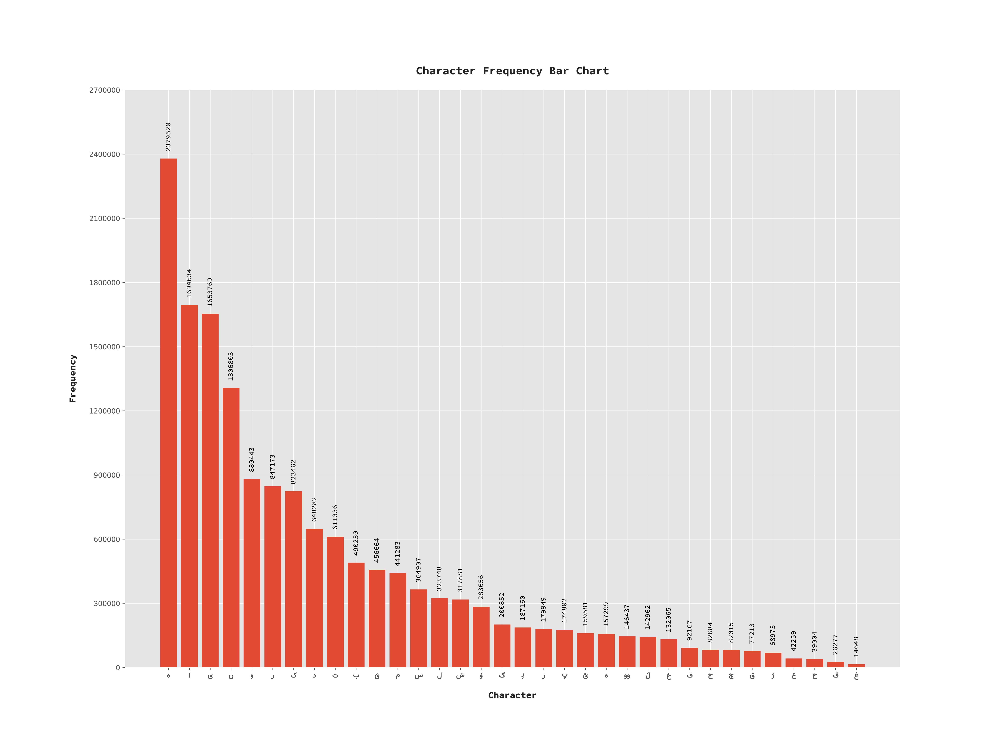

# kurdi

There are some hopefully useful files/scripts/chunks etc. to share with Kurdi developers.

1. kurdi_words.txt: a list of Kurdish words (currently 1,668,692), unique and alphabetically ordered (thanks to @dolanskurd).



Note that in the bar chart, each of (و) and (ی) counted as both vowel and conconant. 

2. unicode_list.txt: list of unicode values for Kurdish alphabet (Arabic script) standard accepted and published on http://unicode.ekrg.org/ku_unicodes.html
3. [gettext](https://en.wikipedia.org/wiki/Gettext) translations, includes ku.po for Drupal. Most of the translations come from https://localize.drupal.org/translate/languages/ku (now almost dead
4. KRG health institutions data (lat/lng and names) throughout KRG (see health)

Now that we have some good unique nad cleaned up wordlist. We can do some statistics on them (in R for now):

``` r
w = readLines("https://raw.githubusercontent.com/layik/kurdi/master/corpus/kurdi_words.txt")
#> Warning in readLines("https://raw.githubusercontent.com/layik/kurdi/
#> master/corpus/kurdi_words.txt"): incomplete final line found on 'https://
#> raw.githubusercontent.com/layik/kurdi/master/corpus/kurdi_words.txt'
length(unique(w))
#> [1] 2087905
length(grep("ئا", w))
#> [1] 61626

ku_v = readLines("https://raw.githubusercontent.com/layik/kurdi/master/corpus/letters_lines.txt")
letters_used = sapply(ku_v, function(x){
  length(grep(x, w))
})
# change h to doucheshme
names(letters_used)[names(letters_used) == 'ه'] = "ھ"
letters_used = sort(letters_used, decreasing = TRUE)

library(ggplot2)
ggplot() + geom_bar(aes(x=names(letters_used),y=letters_used), stat='identity') + xlab('Alphabet') + ylab('Frequency') + theme(axis.text.x = element_text(face = "bold", size = 18)) + scale_y_continuous(labels = scales::comma) + 
  scale_x_discrete(limits=names(letters_used))
```


``` r
letters_used['ە']
#>       ە 
#> 1538232
```

<sup>Above snipped was created on 2019-12-22 by the [reprex package](https://reprex.tidyverse.org) (v0.3.0)</sup>
